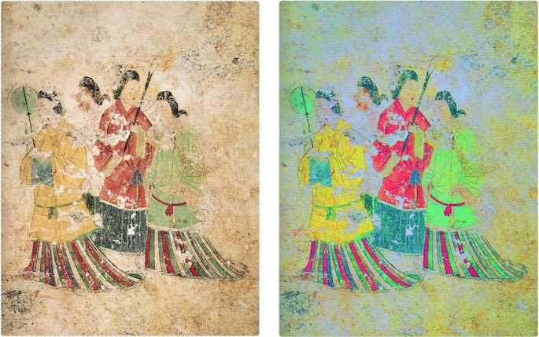

# Decorrelation Stretch 画像補正ツール

画像全体または選択した矩形領域に **Decorrelation Stretch** を適用する、ブラウザ単体で動作する画像補正ツールです。



このツールは、HTML、JavaScript、Canvas、インラインWeb Workerだけで構成されています。

## 主な機能

- 単一HTMLファイルとして配布できます。
    - モダンブラウザ上でローカル実行できます。
    - 外部ライブラリに依存しません。
- 原画像上で矩形範囲を選択できます。
    - Decorrelation Stretchを画像全体または選択した矩形領域に適用できます。
- 主要なアルゴリズムパラメータを手動調整できます。
    - 弱・中・強・かなり強い、のプリセットを備えています。
- PNG保存ができます。
    - 補正後画像を結果ペインからドラッグしてPNG保存できます。
- 再現性・監査用のメタデータJSONを保存できます。
    - 処理ログにパラメータ、共分散行列、固有値、固有ベクトル、倍率、出力レンジが表示されます。

## ファイル構成

このプロジェクトは単一ファイルで実装されています。

```text
src/index.html
```

このファイルをブラウザで開くと利用できます。

## クイックスタート

1. `src/index.html` を開きます。
2. 原画像エリアをクリックするか、画像ファイルをドラッグアンドドロップします。
3. プリセットを選びます。
4. 必要に応じて、原画像上で矩形領域をドラッグ選択します。
5. **補正実行** を押します。
6. 原画像と補正後画像を比較します。
7. **PNG保存** で補正後画像を保存します。
8. **パラメータJSON保存** で処理条件を保存します。

## プリセット

UIには以下のプリセットがあります。

| プリセット | `targetStd` | `lowPercentile` | `highPercentile` | `maxScale` | `samplePixels` |
|---|---:|---:|---:|---:|---:|
| 色差強調 弱 | 40 | 1.0 | 99.0 | 5 | 250000 |
| 色差強調 中 | 55 | 1.0 | 99.0 | 8 | 250000 |
| 色差強調 強 | 70 | 0.5 | 99.5 | 10 | 250000 |
| かなり強い | 85 | 0.5 | 99.5 | 12 | 250000 |

監査や確認用途では、まず弱または中から試してください。強い設定は探索には有効ですが、ノイズ、JPEG圧縮ノイズ、毛並み、泥、影、背景テクスチャなども強調されます。

## パラメータ

| パラメータ | 意味 |
|---|---|
| `targetStd` | 無相関化後の各主成分の目標標準偏差。大きいほど色差が強調されます。 |
| `lowPercentile` | 出力正規化時の下側パーセンタイル。この値より下は黒側に寄せられます。 |
| `highPercentile` | 出力正規化時の上側パーセンタイル。この値より上は白側に寄せられます。 |
| `maxScale` | 主成分ごとの拡大倍率上限。分散が小さい方向の過剰増幅を防ぎます。 |
| `samplePixels` | RGB共分散行列の推定に使う最大画素数。`0` にすると全画素を使います。 |
| `randomSeed` | 再現可能なランダムサンプリングのためのseedです。 |

## 矩形領域選択

原画像上でドラッグすると矩形領域を選択できます。領域を選択した状態で補正を実行すると、以下の動作になります。

- RGB統計は選択領域から推定されます。
- 変換は選択領域内の画素にだけ適用されます。
- 選択領域外の画素は、補正後画像でも元のまま残ります。
- 選択領域はメタデータJSONに記録されます。

これは、対象が画像の一部にしか存在しない場合に有効です。たとえば、スプレー番号が動物の胴体上にある場合、胴体または番号周辺を選択すると、背景の草木や土の色分布の影響を減らせます。

既定では、画像全体にDecorrelation Stretchを適用します。

## 出力ファイル

### PNG画像

補正後画像はPNGとして保存します。

PNGは非可逆圧縮ではないため、判読補助画像の保存に向いています。JPEGは圧縮ノイズを追加する場合があり、Decorrelation Stretchによってそのノイズが目立つ可能性があります。

### メタデータJSON

メタデータJSONには、処理結果の再現・確認に必要な情報が含まれます。

例:

```json
{
  "algorithm": "whole_image_decorrelation_stretch",
  "appVersion": "0.1.0",
  "createdAt": "2026-06-07T00:00:00.000Z",
  "sourceFileName": "input.jpg",
  "width": 4000,
  "height": 3000,
  "region": {
    "x": 0,
    "y": 0,
    "width": 4000,
    "height": 3000
  },
  "params": {
    "targetStd": 55,
    "lowPercentile": 1,
    "highPercentile": 99,
    "maxScale": 8,
    "samplePixels": 250000,
    "randomSeed": 0
  },
  "meanRgb": [42.1, 39.8, 36.4],
  "covarianceRgb": [[...], [...], [...]],
  "eigenvalues": [...],
  "eigenvectors": [[...], [...], [...]],
  "rawScales": [...],
  "appliedScales": [...],
  "lowRgb": [...],
  "highRgb": [...],
  "userAgent": "...",
  "note": "This output is an enhanced visualization derived from the original image. Use it as an inspection aid, not as a replacement for the original evidence image."
}
```

## Decorrelation Stretchの仕組み

### 1. 画素の表現

ブラウザは画像をCanvasの `ImageData` として取得します。

各画素はRGBA形式です。

```text
[R, G, B, A]
```

アルゴリズムでは、色統計と変換にRGBのみを使用します。A、つまりアルファチャンネルは最終出力に保持されます。

処理対象画素のRGBベクトルを次のように定義します。

```text
x_i = [R_i, G_i, B_i]^T
```

有効領域に `N` 個の画素があるとすると、RGBデータ全体は次の行列として考えられます。

```text
X ∈ R^{N×3}
```

各行が1つの画素です。

### 2. 平均RGBベクトル

有効領域から平均RGBベクトルを推定します。

```text
μ = [μ_R, μ_G, μ_B]^T
```

各成分は以下です。

```text
μ_R = (1/N) Σ R_i
μ_G = (1/N) Σ G_i
μ_B = (1/N) Σ B_i
```

`samplePixels > 0` の場合は、有効領域から再現可能なランダムサンプリングを行って平均を推定します。`samplePixels = 0` の場合は、領域内の全画素を使用します。

中心化したRGBベクトルは以下です。

```text
x'_i = x_i - μ
```

平均中心化を行う理由は、共分散が絶対的なRGB値ではなく、平均色からのばらつきを表すためです。

### 3. RGB共分散行列

中心化したRGBベクトルから、RGB共分散行列を計算します。

```text
C = 1 / (N - 1) Σ x'_i x'_i^T
```

RGB画像なので、`C` は `3 × 3` の対称行列です。

```text
C =
[ var(R)    cov(R,G)  cov(R,B) ]
[ cov(G,R)  var(G)    cov(G,B) ]
[ cov(B,R)  cov(B,G)  var(B)   ]
```

この行列は、R、G、Bがどのように一緒に変化しているかを表します。

自然画像では、RGBチャンネルは強く相関していることが多いです。たとえば照明が明るくなると、R、G、Bが同時に大きくなります。通常の明るさ補正やコントラスト補正は、この支配的な明暗方向を伸ばす処理になりやすく、微妙な色差を明示的に分離するわけではありません。

### 4. 固有値分解

共分散行列 `C` を固有値分解します。

```text
C = E Λ E^T
```

ここで、

- `E` は固有ベクトル行列
- `Λ` は固有値を対角に並べた行列

です。

固有ベクトルはRGB色分布の主軸を表します。固有値は、その軸方向にどれだけ分散があるかを表します。

実装では、`3 × 3` 実対称行列専用の小さなJacobi法を使っています。これにより、外部数値計算ライブラリを使わずに済みます。

固有値は大きい順に並べます。

```text
λ_0 ≥ λ_1 ≥ λ_2
```

### 5. 無相関な主成分空間への変換

中心化したRGBベクトルを、固有ベクトル基底へ回転します。

```text
y_i = E^T x'_i
```

実装上は、中心化RGBベクトルと各固有ベクトルの内積として計算しています。

この空間では、推定された共分散モデル上、各成分は無相関になります。

```text
cov(Y) = Λ
```

つまり、それぞれの成分は色分布の独立した主方向を表します。

### 6. 各成分のストレッチ

無相関化された各成分を、標準偏差が `targetStd` に近づくように拡大します。

成分 `j` の生の倍率は以下です。

```text
rawScale_j = targetStd / sqrt(max(λ_j, ε))
```

ここで `ε` はゼロ除算を避けるための小さな値です。

`λ_j` が小さい方向は、元画像では変化が小さかった色方向です。この方向を伸ばすことで、目では見えにくかった微妙な色差が見える場合があります。

ただし、固有値が極端に小さい方向は、ノイズ、JPEG圧縮ノイズ、ほぼ一定の色方向である可能性もあります。そのため倍率には上限を設けます。

```text
scale_j = min(rawScale_j, maxScale)
```

ストレッチ後の成分は以下です。

```text
z_{i,j} = y_{i,j} · scale_j
```

### 7. RGB空間への復元

ストレッチ後のベクトルをRGB空間に戻し、平均を足し戻します。

```text
u_i = E z_i + μ
```

`u_i` は浮動小数点のRGBベクトルです。この時点では `0` 未満や `255` 超の値を含む可能性があり、そのまま表示はできません。

### 8. パーセンタイルによる出力正規化

変換後の有効領域内の全画素について、R、G、Bごとに下側・上側パーセンタイルを求めます。

```text
low_c  = percentile(U_c, lowPercentile)
high_c = percentile(U_c, highPercentile)
```

ここで `c ∈ {R, G, B}` です。

各チャンネルを以下で正規化します。

```text
out_c = 255 · (u_c - low_c) / (high_c - low_c)
```

その後、整数へ丸め、`0〜255` にクリップします。

最小値・最大値ではなくパーセンタイルを使う理由は、ごく少数の極端な画素に出力レンジを支配されないようにするためです。フラッシュ反射、白飛び、センサーノイズ、JPEG圧縮ノイズを含む写真では特に重要です。

### 9. 出力画像の合成

処理対象領域内のRGB値を、正規化後のRGB値に置き換えます。

選択領域外の画素は元画像のまま残します。

アルファチャンネルは元画像からコピーします。

## Web Workerを使う理由

Decorrelation Stretchでは、複数回の全画素走査が必要です。

1. 平均推定
2. 共分散推定
3. 変換
4. パーセンタイル計算
5. 正規化

大きな画像では時間がかかるため、メインスレッドで処理するとブラウザUIが固まります。このアプリでは、アルゴリズム本体をインラインWeb Workerで実行し、メインスレッドには進捗通知を返す構造にしています。

## WebAssemblyを使っていない理由

この実装では、意図的にWebAssemblyを使っていません。

重い処理は `3 × 3` の固有値分解ではなく、画像画素の繰り返し走査です。初期版では、TypedArrayとWeb Workerを使ったJavaScript実装の方が、配布・デバッグ・保守が容易です。

将来、CLAHE、Retinex、ノイズ除去、ブレ補正、複数画像の一括処理などを追加し、実測上の性能問題が出た場合にWASM化を検討するのが妥当です。

## 実務上の解釈

Decorrelation Stretchは、弱い色差を見えやすくする一方で、意味のないパターンも強調します。

特に注意すべきものは以下です。

- JPEG圧縮ノイズ
- 暗所撮影のセンサーノイズ
- 泥、毛並み、布目、壁面テクスチャ
- 血液、影、ライト反射
- 強すぎるプリセット

推奨ワークフロー:

1. まず原画像を見る。
2. **色差強調 弱** または **色差強調 中** を試す。
3. 必要に応じて対象周辺を矩形選択する。
4. 補正後画像と原画像を必ず比較する。
5. 確認記録に使う場合は、PNGとメタデータJSONを保存する。
6. 非常に強い補正でしか見えない特徴は、不確実なものとして扱う。

## 制限事項

- 強調された特徴が意味のある対象であることは保証しません。
- 矩形選択モードでは、選択領域だけを処理し、それ以外は元画像のまま残します。
- パーセンタイル計算はソート配列を使うため、非常に大きな領域ではメモリを多く使う場合があります。

## トラブルシューティング

### 結果がノイズっぽい

以下を試してください。

- `targetStd` を下げる
- `maxScale` を下げる
- **色差強調 弱** を使う

### 結果が弱すぎる

以下を試してください。

- `targetStd` を上げる
- `maxScale` を上げる
- **色差強調 強** を使う

### 背景の色に引っ張られる

対象周辺を矩形選択してから、もう一度補正を実行してください。

### 処理が遅い

対象領域だけを矩形選択してください。非常に高解像度の画像でなければよい場合は、入力画像を縮小してから使うことも検討してください。

### PNGのドラッグ保存が動かない

ブラウザやOSによってドラッグ保存の挙動が異なる場合があります。その場合は **PNG保存** ボタンを使ってください。

## ライセンス

See [LICENSE](LICENSE).
